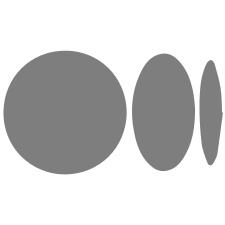

### Hello / नमस्ते / Bonjour / Hola  👋
I am [Aman](https://vijama1.github.io/), a passionate and creative developer from [India](https://en.wikipedia.org/wiki/India)&nbsp;.
#### Full Stack Polyglot Engineer  | Technical Writer | Spring Boot | ReactJs | Social Entrepreneurship Enthusiast

    
    
    

- 🔭 I’m currently working on gRPC!
- 🌱 I’m currently learning Quantum Computing
- 🥅 2021 Goals: Contribute more to Open Source projects
- ⚡ Fun fact: I love astrophysics & reading.
- 👨🏽‍💻 [Covid19Assist](https://www.covid19assist.in) - Checkout the Covid19 Resources portal.

### 📕 Latest Blog Posts
- [Into a World of Quantum Supremacy](https://medium.com/analytics-vidhya/into-a-world-of-quantum-supremacy-73e77d6fcbf2)
- [The Quintessential Energy](https://medium.com/@aman_vijay/the-quintessential-energy-2cce309bc140)
- [Embellished Dark Source of Unending Creation](https://medium.com/@aman_vijay/embellished-dark-source-of-unending-creation-3268246dd8b1)

➡️ [more blog posts...](https://medium.com/@aman_vijay)
